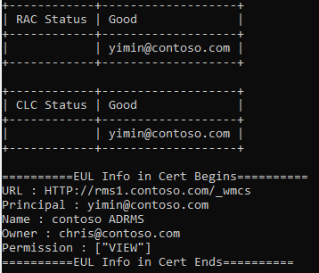
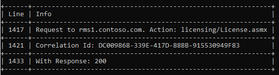
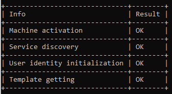

# Log Analyzer for AIP/RMS

This repository is for a tool to analyze AIP/RMS related logs. It helps with the process of decryption/encryption analysis and understanding the communication between RMS server and client machine under different troubleshooting scenarios.

For RMS theory we recommend visiting our official document: [How does Azure RMS work? Under the hood](https://docs.microsoft.com/en-us/azure/information-protection/how-does-it-work).

## Getting started

Run the tool by double click **SmallTool.exe**. Input the log file path and we could get the analysis report.

This tool uses **rules.json** file to define the requirements:

```json
{
   "LogOnly":true,
   "LogAnalyse":true,
   
   "ResponseType":"exclude",
   "Mode":2,
   "ResponseCodeList":[
   "200"
   
   ],
   
   "CertAnalyse":false,
   "CertRules":{
      "RAC":[
         "<URL>/XrML/BODY/ISSUER/OBJECT/ADDRESS</URL>",
         "<Principal>/XrML/BODY/ISSUEDPRINCIPALS/PRINCIPAL/OBJECT/NAME</Principal>",
         "<Name>/XrML/BODY/ISSUER/OBJECT/NAME</Name>"
      ],
      "CLC":[
         "<URL>/XrML/BODY/ISSUER/OBJECT/ADDRESS</URL>",
         "<Principal>/XrML/BODY/ISSUEDPRINCIPALS/PRINCIPAL/OBJECT/NAME</Principal>",
         "<Name>/XrML/BODY/ISSUER/OBJECT/NAME</Name>"
      ],
	  "EUL":[
         "<URL>/XrML/BODY/ISSUER/OBJECT/ADDRESS</URL>",
         "<Principal>/XrML/BODY/ISSUEDPRINCIPALS/PRINCIPAL/OBJECT/NAME</Principal>",
         "<Name>/XrML/BODY/ISSUER/OBJECT/NAME</Name>",
		 "<Owner>/XrML/BODY/WORK/METADATA/OWNER/OBJECT/NAME</Owner>",
		 "<Permission>/XrML/BODY/WORK/RIGHTSGROUP/RIGHTSLIST</Permission>"
      ]
   }
}
```

 - LogOnly:
 - LogAnalyse:
 - Mode:
 - ResponseType:
 - ResponseCodeList:
 - CertAnalyse:

## Report Details

### License/Certificate info in MSIPC folder

If "CertAnalyse" is enabled, we could get certificate and license information from MSIPC folder:


For more information about RMS Licenses and Certificates: [Licenses and Certificates](https://techcommunity.microsoft.com/t5/security-compliance-and-identity/licenses-and-certificates-and-how-ad-rms-protects-and-consumes/ba-p/247309)

### Request/Response info in MSIPC Logs folder

From Log files, we could get the request URLs sending from client and response code getting from server. It helps us quickly narrow down the issue. (  access deny with multi-accounts; server issue in AD RMS scenario, etc.)



With Correlation Id, RMS server trace could be queried from Kusto under Azure RMS scenario.

### Bootstrap analysis

This module analyzes the process of bootstrap, including machine activation, service discovery, user identity initialization and templates downloading. If we detect some key words indicating issues, the Result will be "May fail/skip"



### File encrypt info

### File decrypt info

